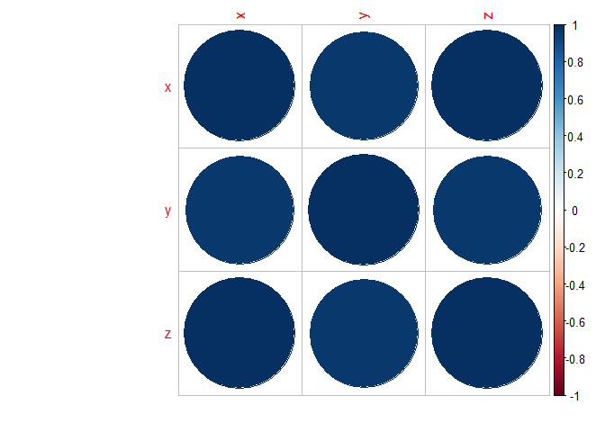

Advanced Statistics Module 8 - Hypothesis Testing and Correlation Analysis
================

First Question:
===============

The director of manufacturing at a cookie store needs to determine whether a new machine is producing a particular type of cookie according to the manufacturer's specifications, which indicate that each batch of cookies should have a mean of 70 and standard deviation of 3.5 pounds. A sample of 49 batches of cookies reveals a sample mean size of 69.1 pounds.

A. State the null and alternative hypothesis

The Null Hypothesis (H<sub>0</sub>) is that the cookies are not approximately equal to 70 pounds.

The Alternative Hypothesis (H<sub>A</sub>) is that the cookies are approximately equal to 70 pounds.

B. Is there evidence that the machine is not meeting the manufacturer's specifications for average weight? Use a 0.05 level of significance

``` r
qnorm = round(qnorm(.95),4)

xbar = 69.1
popmean = 70
sd = 3.5
sampsize = 49
```

In order to accept or claim the null hypothesis, we must determine whether or not our Z value is less than or greater than 1.6449. To find our test statistic, we know that the sample mean (xbar) is 69.1, the value of the population mean (μ) for the null hypothesis is 70, the standard deviation is 3.5, and the sample size is 49.

``` r
z = round((xbar-popmean)/(sd/sqrt(sampsize)),4)
```

We can now calculate the z value which in this case is -1.8, and since this value falls outside the range of (1.6449, -1.6449), we can reject the null hypothesis, meaning there is not evidence that the machine is not meeting specifications.

C. Compute the p value and interpret its meaning

``` r
pval = round(2*pnorm(-abs(z)),4)
```

The p value is 0.0719, so we can not yet accept nor reject the null hypothesis.

D. What would be your answer in (B) if the standard deviation were specified as 1.75 pounds?

``` r
sd = 1.75
z = round((xbar-popmean)/(sd/sqrt(sampsize)),4)
```

If the standard deviation were 1.75 instead of 3.5, the new z score would be -3.6, meaning we would have even more reason to reject the null hypothesis and again there would be little evidence that the machine is not meeting specifications.

What would be your answer in (B) if the sample mean were 69 pounds and the standard deviation is 3.5 pounds?

``` r
xbar = 69
sd= 3.5
z = round((xbar-popmean)/(sd/sqrt(sampsize)),4)
```

If the sample mean was 69 pounds and the standard deviation was 3.5 pounds, the z value would be -2, meaning that we would still reject the null hypothesis and would have little evidence against the machine not meeting specifications.

Second Question:
================

If x̅ = 85, σ = standard deviation = 8, and n=64, set up 95% confidence interval estimate of the population mean μ.

``` r
z = round(qnorm(.95),4)
me = z*(8/sqrt(64))
me = round(me,4)


cipos = round((85+me),4)
cineg = round((85-me),4)
```

We are 95% confident that the population mean falls within 86.6449 and 83.3551.

Third Question using Correlation Analysis
=========================================

``` r
library(readxl)
df = read_excel("C:/Users/adamw/Documents/Advanced Statistics/Module 8/Copy of module # 8.xls")
```

    ## New names:
    ## * `` -> ...2
    ## * `` -> ...3
    ## * `` -> ...4

``` r
x = c(df$...2)
y = c(df$...3)
z = c(df$...4)

df = data.frame(x,y,z)
df = na.omit(df)

pearson = cor(df,method="pearson")
spearman = cor(df,method="spearman")
```

Here we can see the correlation coefficients for this dataset.

``` r
pearson
```

    ##           x         y         z
    ## x 1.0000000 0.9956473 0.9996230
    ## y 0.9956473 1.0000000 0.9978234
    ## z 0.9996230 0.9978234 1.0000000

Here are the pearson correlation coefficients.

``` r
spearman
```

    ##           x         y         z
    ## x 1.0000000 0.9634146 1.0000000
    ## y 0.9634146 1.0000000 0.9634146
    ## z 1.0000000 0.9634146 1.0000000

And here are the spearman correlation coefficients.

``` r
library(corrplot)
```

    ## corrplot 0.84 loaded

``` r
corrplot(pearson)
```


``` r
corrplot(spearman)
```



Here we can see our three correlation plots. The first being our Pearson coefficients, and secondly the Spearman coefficients. With both of these graphs, it is evident that there is very strong correlation between all three columns of our dataset.
